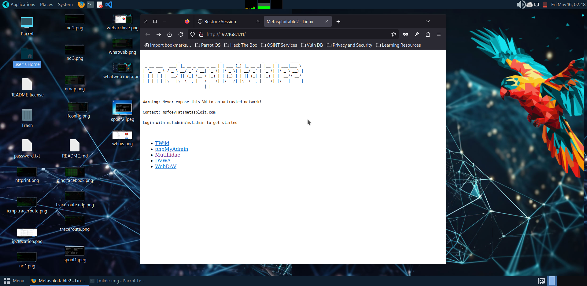
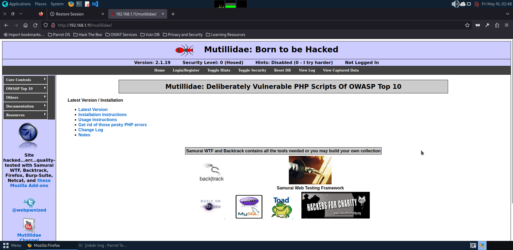
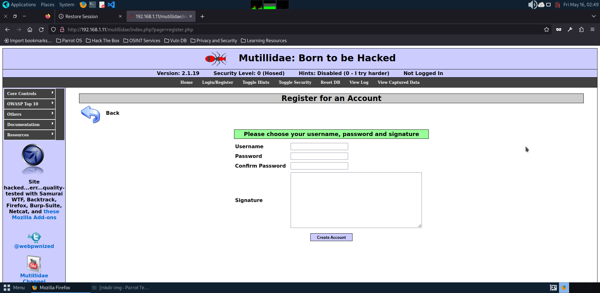
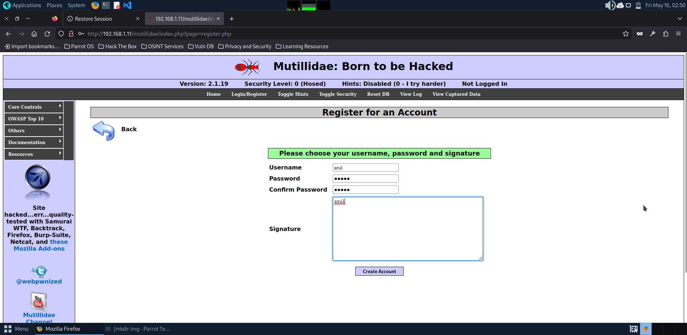
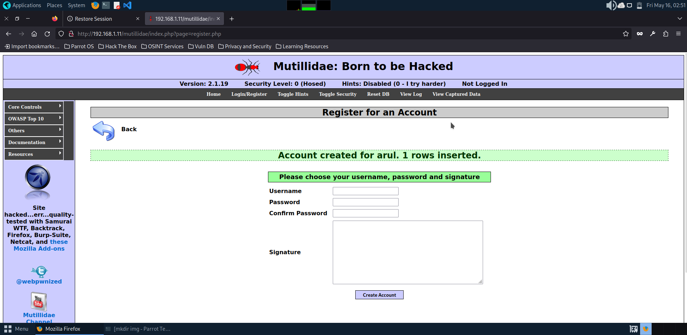
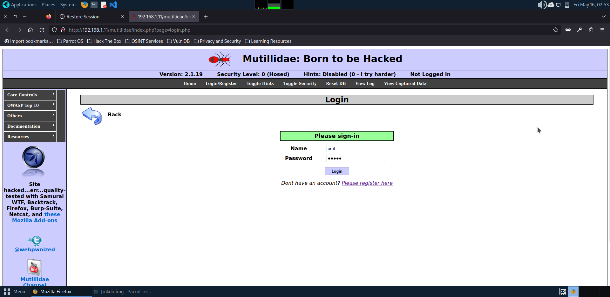
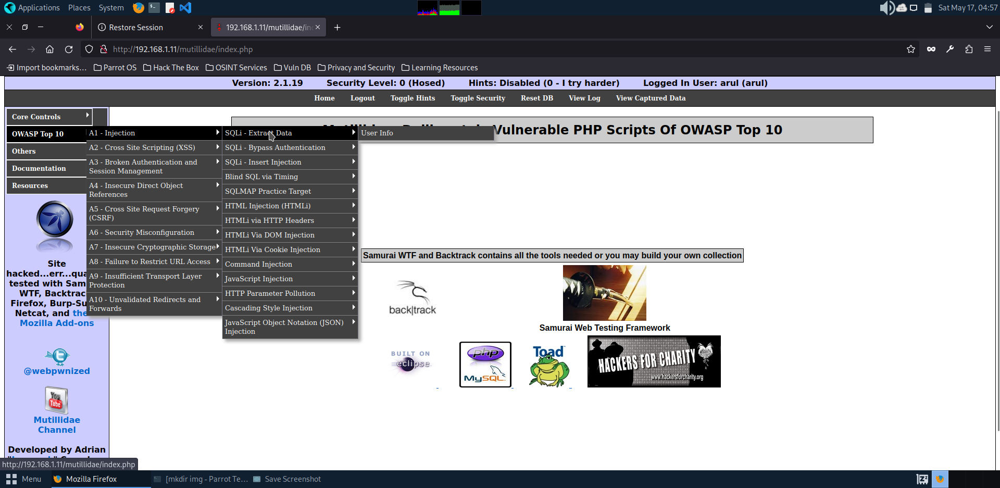

# sqlinjection
Exploiting SQL Injection vulnerability

# AIM:
To exploit SQL Injection vulnerability using Multidae web application in Metasploitable2

## DESIGN STEPS:

### Step 1:

Install kali linux either in partition or virtual box or in live mode

### Step 2:

Investigate on the various categories of tools as follows:

### Step 3:

Open terminal and try execute some kali linux commands

## EXECUTION STEPS AND ITS OUTPUT:

## RESULT:
The SQL Injection vulnerability is successfully exploited using the Multidae web application in Metasploitable2.
