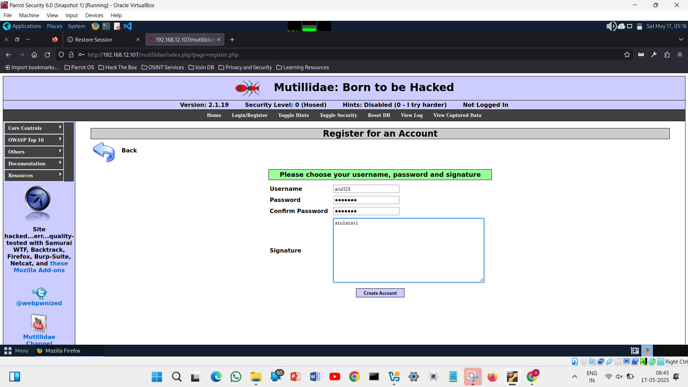
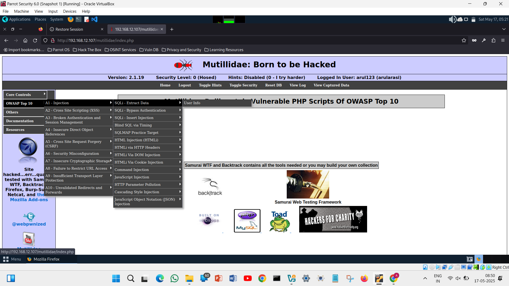

# sqlinjection
Exploiting SQL Injection vulnerability

# AIM:
To exploit SQL Injection vulnerability using Multidae web application in Metasploitable2

## DESIGN STEPS:

### Step 1:

Install kali linux either in partition or virtual box or in live mode

### Step 2:

Investigate on the various categories of tools as follows:

### Step 3:

Open terminal and try execute some kali linux commands

## EXECUTION STEPS AND ITS OUTPUT:

SQL Injection is a sort of infusion assault that makes it conceivable to execute malicious SQL statements. These statements control a database server behind a web application. Assailants can utilize SQL Injection vulnerabilities to sidestep application safety efforts. They can circumvent authentication and authorization of a page or web application and recover the content of the whole SQL database. 

Identify IP address using ifconfig in Metasploitable2

Use the above ip address to access the apache webserver of Metasploitable2 from kali linux. In Kali Linux use the ip address in a web browser.

Select Multidae from the menu listed as shown above. You will get the page as displayed below:

Click on the menu Login/Register and register for an account
Click on the link “Please register here”

Click on “Create Account” to display the following page:

The login structure we will use in our examples is straightforward. It contains two input fields (username and password), which are both vulnerable. The back-end content creates a query to approve the username and secret key given by the client. Here is an outline of the page rationale:
($query = “SELECT * FROM users WHERE username=’$_POST[username]’ AND password=’$_POST[password]’“;).
 For the username put “ganesh” or “anything” and for the password put (anything’ or ‘1’=’1) or (admin’ or ‘1’=’1) then try to log in, and you’ll be presented with an admin login page.

## RESULT:
The SQL Injection vulnerability is successfully exploited using the Multidae web application in Metasploitable2.
